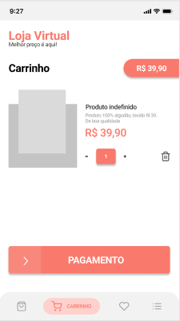

# Loja Virtual

Estudos com flutter e Designer UX.

## Telas Principais

     
     
     
     

Para visualizar todas as screen do projeto no figma acesse abaixo

[Abrir projeto no figma.](https://www.figma.com/file/VP1ORbX8PWAyjZLqt3v4Qw/Estudos?node-id=0%3A1)

# Motivação do Projeto.

Aumetar os conhecimento com o desenvolvimento mobile com flutter e aproveitar junto com a ideia colocar em pratica os conhecimeno de ux para praticar e melhor para no futuro criar prototipagens incriveis.

## License
[MIT](https://choosealicense.com/licenses/mit/)

#

#### Feito por Denilson Cesar 🚀
